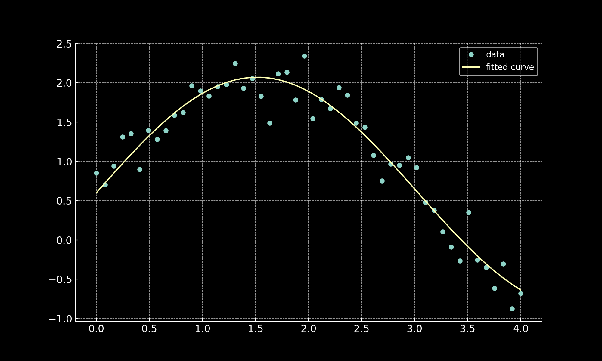

The Levenberg-Marquardt Algorithm (LMA) is a technique used to solve non-linear least squares problems, and it's particularly effective for non-linear regression. The LMA interpolates between the Gauss-Newton Algorithm (GNA) and the method of Gradient Descent. The LMA is more robust than the GNA, which means it finds a solution even if it starts very far off the final minimum. This code uses:

- A model function, which is a sine function with parameters a, b, and c.
- A function to compute residuals, which are the differences between the observed and predicted values.
- A Jacobian function, which computes the Jacobian matrix of the residuals with respect to the parameters.
- A function for the Levenberg-Marquardt optimization, which takes in the residuals function, the Jacobian function, the initial parameters, and the data, and returns the optimized parameters.
- Code to generate synthetic data.
- Code to call the Levenberg-Marquardt optimization function and plot the data and the fitted curve.

The plot above shows the synthetic data points generated from the sine function with added noise (shown as blue circles), and the curve fitted by the Levenberg-Marquardt algorithm (shown as an orange line).
